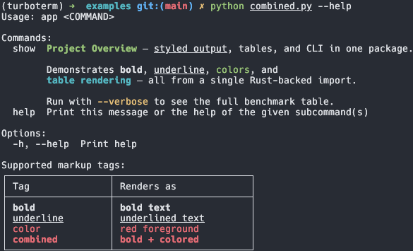
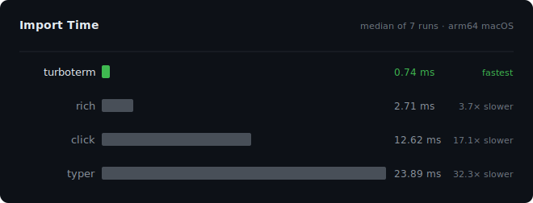
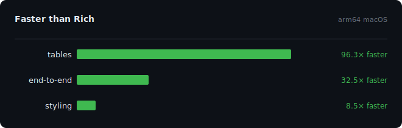

<h1 align="center">TurboTerm</h1>
<p align="center">
    <em>⚡ A high-performance terminal styling and CLI toolkit for Python, written in Rust 🦀</em>
</p>

<p align="center">
    
</p>

Styled output, tables, and argument parsing — all three from a single Rust-backed import.
TurboTerm covers 90% of CLI use cases in a single package and aims to provide
the fastest possible performance with the smallest possible footprint.

<p align="center">
  
</p>
<p align="center">
  
</p>

## Installation

```
pip install turboterm
```

## Development

```bash
git clone https://github.com/valentinstn/turboterm.git
cd turboterm
uv run maturin develop
```

### Running tests

```bash
uv run python -m unittest discover tests
```

### Running benchmarks

```bash
uv run python scripts/benchmark.py    # full benchmark + regenerate charts
```

## License

MIT License
